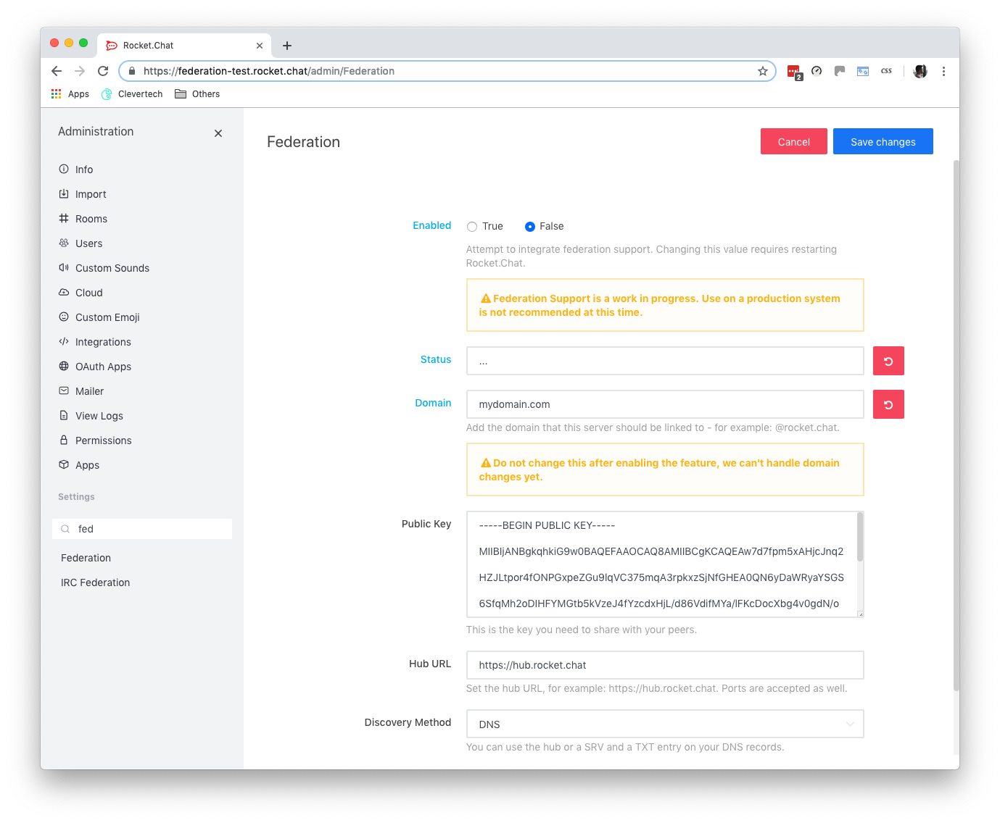

# Federation

## Introduction

Rocket.Chat Federation allows servers to communicate with each other, with no limits on the number of connected servers.

We use industry standards, like DNS records, keeping the process as seamless as possible, seeking the most hassle-free communication between servers.

When enabling federation on your server, your server becames part of the Rocket.Chat Federated Network, which allows it to find and exchange messages and files with other Federation enabled Rocket.Chat servers.

## Features

- **Current**
  - Inviting users from remote servers;
  - Direct chats between servers;
  - Public, private and broadcast rooms with remote users from any number of servers;
  - Read receipts, notifications and alerts are distributed to remote servers;
  - Mute/Unmute remote users;
  - File sharing among servers;
- **Confirmed next features**
  - Encrypted rooms;
  - Whitelist servers to communicate with;
  - Better federation setup process, with helpers to validate the configuration;

## Configuration

When you open Federation's config screen, you will see this:

Below, a brief explanation of each configuration option:

#### Enabled

This determines whether or not Federation is enabled on this server.

#### Status

This is the current Federation status, which can be one of the following:

- **Could not enable, settings are not fully set :** Make sure all the options are correctly filled and saved;
- **Booting... :** federation is initializing;
- _[HUB Only]_ **Registering with Hub... :** federation is trying to register with the Hub;
- _[HUB Only]_ **Disabled, could not register with Hub :** federation could not register with the Hub;
- **Disabled :** federation is disabled
- **Running :** federation is running and ready to communicate with other servers;

#### Domain

Fill this option with your domain name, usually where the Rocket.Chat server is hosted.

#### Public Key

All Federation communications are double encrypted, which means messages cannot be delivered by mistake to a wrong peer. This is your public key, which is specially generated for Rocket.Chat and by Rocket.Chat, which will be shared with peers you are communicating with.

The encryption process encrypts the message using the Server A private key, and the Server B public key.

When a server receives the message, it uses the Server B private key and the Server A public key to decrypt it.

So, let's say the message ended up on Server C: this server won't have Server B's private key to decrypt it, so the message can't be read at all.

#### Hub URL

This usually remains as is. This is the Hub URL, where your server will register and confirm domain ownership if you are not using DNS discovery method.

#### Discovery Method

How are you going to be found in the Rocket.Chat Federated Network? You can choose through DNS or, as a fallback, the Rocket.Chat Hub.

**Important:** We recommend using the DNS method. The Hub is a tool to allow users to easily adopt, try and validate the feature or as a different way to be part of the Rocket.Chat Federated Network until DNS record changes are made. Also, the Hub requires external communication and access to a specific e-mail address owned by your domain, as explained below, which introduces extra configuration steps in some protected internal networks.

## Adding Federation to your server

You have two ways of adding your server to the Rocket.Chat Federated Network:

### Recommended: Configuring your DNS

To add your server to the Federated Network using the DNS, fill all the needed configuration fields (making sure you are picking **true** on the _Enabled_ field), pick the `DNS` _Discovery Method_ option, save and follow the guide below.

Let's suppose we have a domain named `mydomain.com`, and my Rocket.Chat server is hosted at `chat.mydomain.com`, port `80`.

You'll have to add two DNS records:

#### SRV Record

- Service: `_rocketchat`
- Protocol: `_tcp`
- Name: `mydomain.com`
- Weight: `1`
- Priority: `1`
- TTL: `1 hour`
- Target: `chat.mydomain.com`
- Port: `80`

In Amazon Route 53 it would look something like this:

#### TXT Record

- Host: `@.mydomain.com`
- Value: `rocketchat-public-key=<my public key, as shown on the configuration screen>`

When both of those entries are added to the DNS records, you should be able to be found by other peers after the propagation.

### Alternative: registering on Hub

To add your server to the Federated Network using the Hub, fill all the needed configuration fields (making sure you are picking **true** on the _Enabled_ field), pick the `Hub` _Discovery Method_ option, save and follow the guide below.

#### Confirm domain ownership

When you click `Save` on the federation config screen, you will begin the registration process. This process takes a few seconds and if you are not yet registered to the Hub, you should receive an email at `webmaster@mydomain.com`, where `mydomain.com` is the domain address you configured on the `Domain` field.

Make sure the data is correct and confirm the changes.

After that step, you should be able to be found on the Rocket.Chat Federated Network.

## Using Rocket.Chat Federation

Click [here](../../user-guides/talking-to-users-from-another-server/) to learn how to use Rocket.Chat federation.
