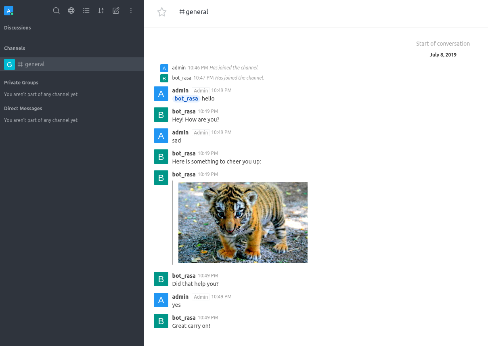

# Running a Rasa Bot

Rasa is the leading open-source machine learning toolkit that lets developers expand bots beyond answering simple questions
with minimal training data. At the core Rasa bot has a machine learning model which trained on example conversations.

## Quickstart

Rasa is developed with Python, but for the most part you dont need to know python to design the basic conversational flows in Rasa.
You will need python knowledge when creating custom actions in Rasa which calls external actions. The fastest way to start with
Rasa is by using [Rasa starter kit](https://github.com/RocketChat/rasa-kick-starter). The starter kit uses webhooks to
communicate between Rasa and Rocket.Chat.

Clone the quick start guide with the following command to get started  with the setup.

`git clone https://github.com/RocketChat/rasa-kick-starter`

### Create Rocket.Chat Bot

You can either manually login to Rocket.Chat and create a bot user via the user management page or you can use the following
script to create the bot user.

Note: Please replace the username and password of the RocketChat admin and bot user accordingly.

```sh
python3 scripts/bot_config.py -an admin_username -ap admin_password -bn bot_username -bp bot_pass -r http://rocketchaturl
```

### Configure Rasa Bot

* Update the `credentials.yml` file inside the `bot_rasa` folder with Rasa bot's username, password, and Rocket.Chat URL.

```sh
rocketchat:
  user: "bot_rasa"
  password: "bot_rasa"
  server_url: "http://localhost:3000"
```

* Train the bot's Machine Learning Model by using the following command. After the training a machine learning model will
 be created inside the `bot_rasa/models` folder.

```sh
docker run -it -v $(pwd)/bot_rasa:/app rasa/rasa train
```

* Use the following command to start the Rasa bot(Server).

```sh
docker-compose up -d bot_rasa
```

* The Rasa bot should be reachable via Rocket.Chat. If the Rocket.Chat(Docker) is running in the same machine
 then the bot's URL is: `http://bot_rasa:5005`. Otherwise let's use ngrok to get a public url for the Rasa Bot.

Install ngrok via: <https://ngrok.com/download>

After downloading the ngrok navigate to the ngrok file in the downloaded content and execute the following command.
This will provide a public URL to the Rasa bot (Eg. `http://e3d5a17b.ngrok.io`).

```bash
./ngork http 5005
```

Following will be the output of ngrok:

```sh
Session Status                online
Session Expires               7 hours, 59 minutes
Version                       2.3.30
Region                        United States (us)
Web Interface                 http://127.0.0.1:4040
Forwarding                    http://e3d5a17b.ngrok.io -> http://localhost:5005
Forwarding                    https://e3d5a17b.ngrok.io -> http://localhost:5005
```

Copy the http URL provided by ngrok: `http://e3d5a17b.ngrok.io`

### Configure Rocket.Chat webhook

Go to `Administration > New Integration > Outgoing webhook` and inside the configuration and set the following values:

```
Event Trigger: Message Sent
Enabled: True
Channel: #general
URLs: http://ngrok_public_url/webhooks/rocketchat/webhook
Post as: bot_rasa
```

Note: Replace the URL field accordingly and `Save` the changes.

### Talk to the Bot

Go to the #general channel and type `@bot_rasa hello` to start a conversation with the Rasa bot

