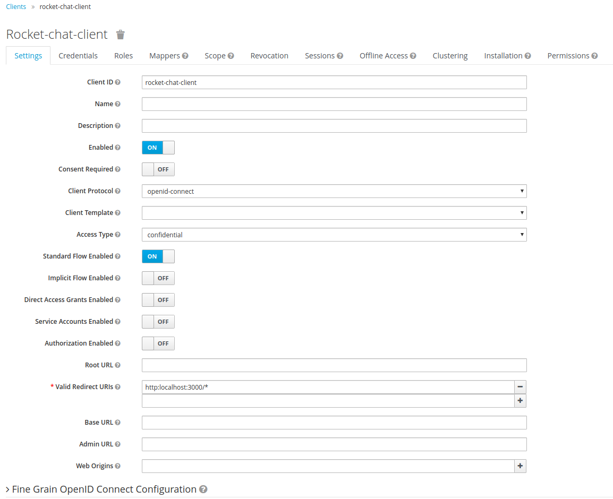
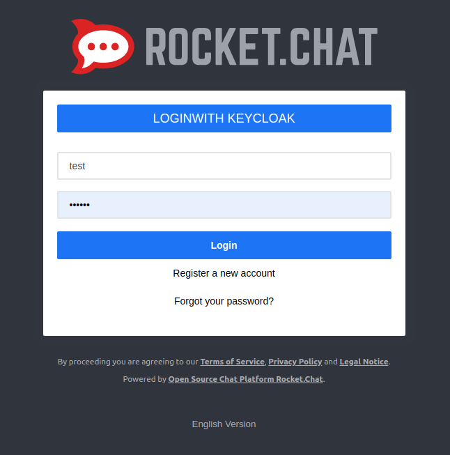
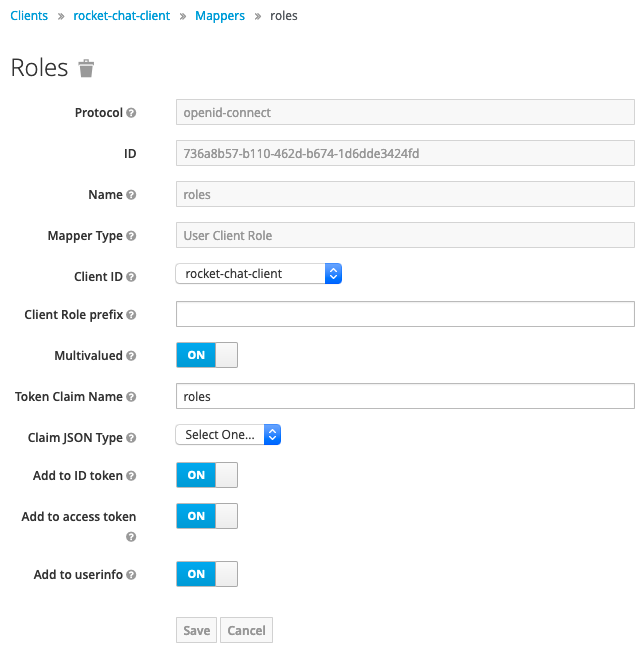

# Keycloak

## Configuring Keycloak OpenID Connect

Create a client in Keycloak.

1. Provide a client ID: `rocket-chat-client`
2. Select the client protocol as openid-connect
3. Select the client access type as confidential
4. Standard flow implemented: ON
5. Valid Redirect URL: `http:{Rocket.Chat_server_address}/*`

The following image shows the minimal configurations needed to setup Keycloak as an Identity Provider to Rocket.Chat.

After saving the changes a new credentials tab will be created for the client. This credentials tab will provide the client secrets which will be used when configuring the Rocket.Chat.

## Configuring Rocket.Chat

### Create a Custom Oauth provider

* Login to Rocket.Chat with an administrator account and navigate to OAuth page.
* Click the Add custom OAuth button and provide the following configurations

The URL paths provided in the below configurations can be also obtained by navigating to the Realm setting and clicking the endpoints link in the `General Tab`. While configuring the below settings replace the `realm_name` with the appropriate realm name. The default realm provided by Keycloak is `master`.

1. URL: `http://{keycloak_ip_address}:{port}/auth`
2. Token Path: `/realms/{realm_name}/protocol/openid-connect/token`
3. Token sent via: Header
4. Identity Token Sent Via: Same As "Token Sent Via"
5. Identity Path `/realms/{realm_name}/protocol/openid-connect/userinfo`
6. Authorize Path `/realms/{realm_name}/protocol/openid-connect/auth`
7. Scope: `openid`
8. Param Name for access token: `access_token`
9. Id: This is the id of the Rocket.Chat client created in the keycloak `rocket-chat-client`
10. Secret: Secret key provided in the credentials tab when creating the Rocket.Chat client
11. Button Text: `Login with Keycloak`

Leave the rest of the configurations as default.   Click the blue button Save Changes at the top.

Next, make sure you enable the new Keycloak provider.   And click the Refresh OAuth Services button.

Now logout from Rocket.Chat to view the keycloak based login option visible in the login page.

## Mapping non-federated keycloak user roles to Rocket.Chat roles

This section documents how client-specific roles of keycloak managed user can be mapped to Rocket.Chat roles. This does not work for federated users \(e.g. LDAP managed users\).

For this example, we map the `admin` and `livechat-manager` role, as documented in [Permissions](https://docs.rocket.chat/administrator-guides/permissions/).

First we add the required roles to the client

then we have to add a mapper entry, that maps our client roles to OpenId, passing the value to Rocket.Chat

Now in order to grant the Rocket.Chat role to a user, we have to modify the users Role Mappings.

!\[User Role Mapping\]\[User Role Mapping\]

The roles are only synced on first login, and not being refreshed on each login. Please see the [bug report](https://github.com/RocketChat/Rocket.Chat/issues/15225) for current state.

\[User Role Mapping\]: user\_role\_mapping.png

