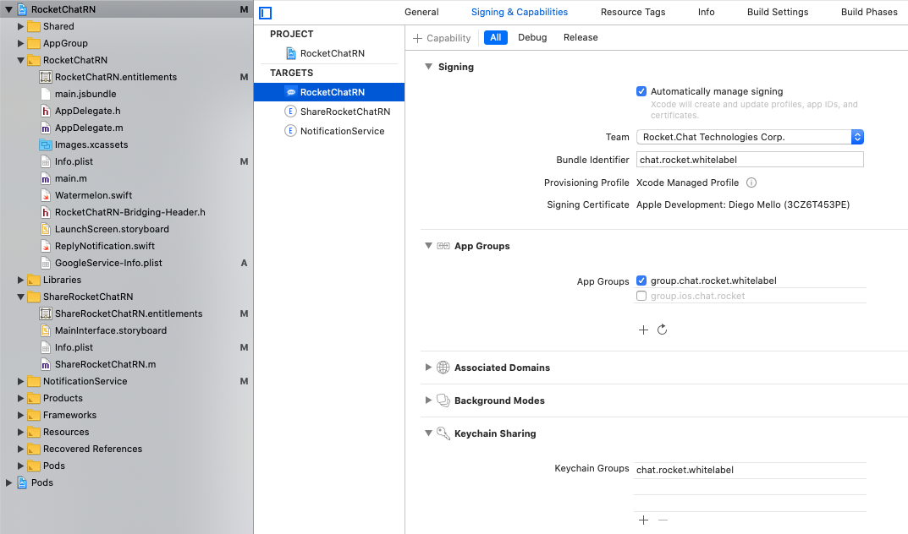
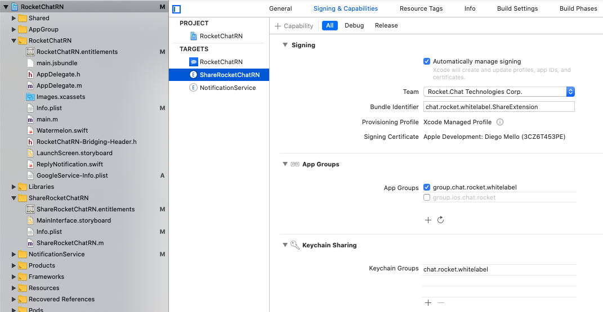
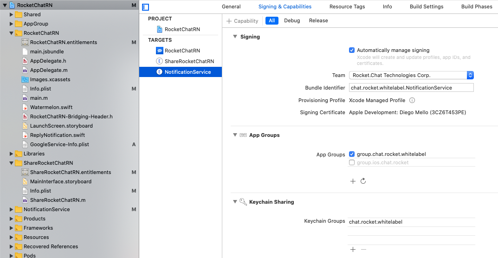
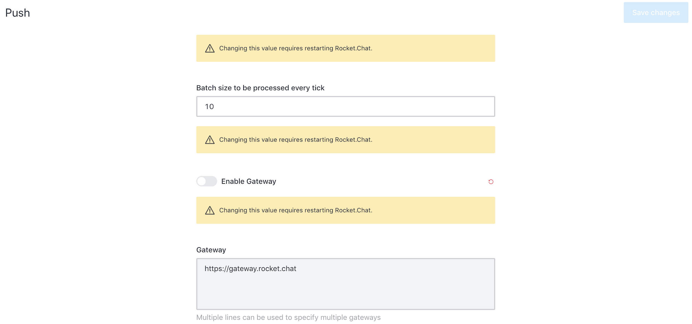
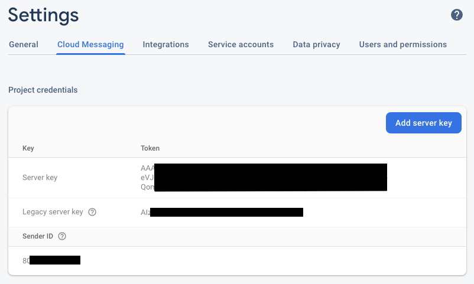
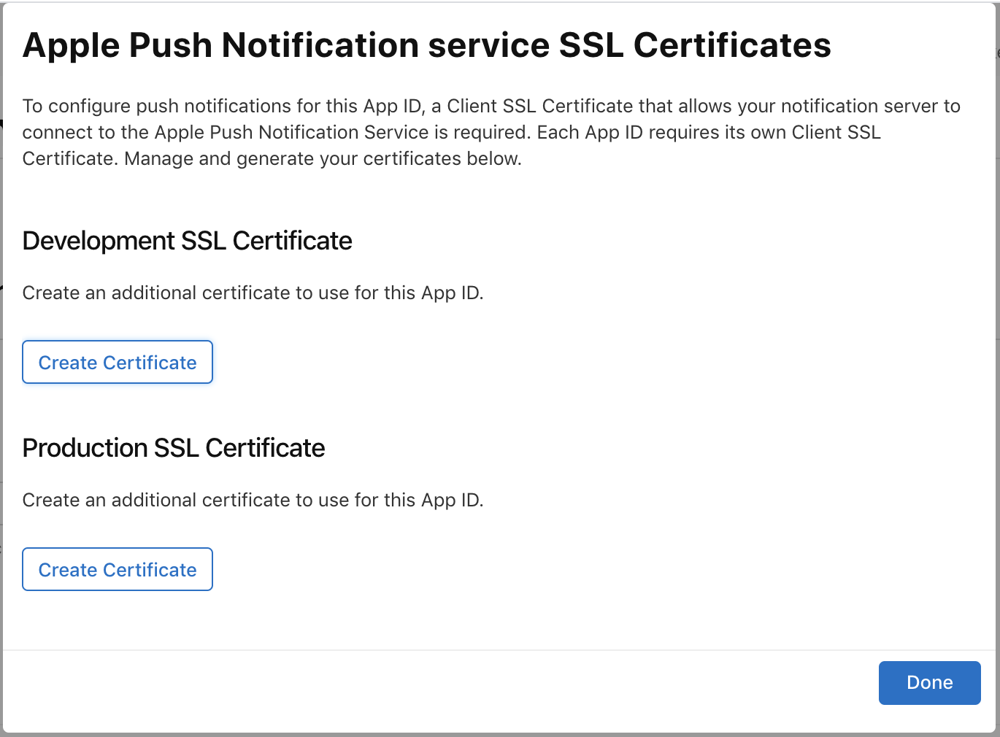

# Whitelabeling mobile apps

In this guide we will cover how to rebrand Rocket.Chat Mobile Apps to suit your styling.

Here we will show you how to customize:

* The App Icons
* Splash Screens
* App Name
* Colors

## Important

* This document is updated after every release, so we can guarantee it's stable for production
  * `develop` branch might be different from this
* Keep in mind that you will need an **intermediate** knowledge of Android/iOS development and basic Javascript knowledge
* Our repo contains targets/build flavors to build both our Experimental and Official apps
  * Both apps are equal, but released at different pace on the stores
  * If you see an Experimental folder, don't be scared of breaking anything. It's just a folder containing the assets for the non-official app

## Repo

* Make sure you have both iOS and Google developer accounts and the respective development environments working
  * You can follow this guide: [https://reactnative.dev/docs/getting-started](https://reactnative.dev/docs/getting-started)
* Clone [https://github.com/RocketChat/Rocket.Chat.ReactNative](https://github.com/RocketChat/Rocket.Chat.ReactNative)
* Checkout `single-server` branch \(git clone -b single-server [https://github.com/RocketChat/Rocket.Chat.ReactNative](https://github.com/RocketChat/Rocket.Chat.ReactNative)\)

## General

* Create an account on [https://www.bugsnag.com/](https://www.bugsnag.com/)
* Set `BUGSNAG_API_KEY` on [config.js](https://github.com/RocketChat/Rocket.Chat.ReactNative/blob/single-server/config.js#L2)
* Set `server`, `appGroup` and `appStoreId` on [app.json](https://github.com/RocketChat/Rocket.Chat.ReactNative/blob/single-server/app.json#L5)
  * `appGroup` must be the same App Group created for the iOS app
* Change app colors on [colors.js](https://github.com/RocketChat/Rocket.Chat.ReactNative/blob/single-server/app/constants/colors.js)

## Firebase

### Creating a new project on Google Cloud Platform

* Visit [https://console.cloud.google.com/home/dashboard](https://console.cloud.google.com/home/dashboard)
* By the text Google Cloud Platform there is a dropdown, open and then “Create project”
* In the dialog give an project name then “Create”
* Wait the creating process, you can follow in notifications by your avatar
* You will be redirected to the project page after creation

### Creating new Firebase project

* Visit [https://console.firebase.google.com/](https://console.firebase.google.com/)
* Click on “Add Project”
* Enter the project name you created on previous step
* Follow the wizard until Firebase project is created
* We’re going to create the apps later on the tutorial

## iOS

### General setup

* Open [RocketChatRN.xcworkspace](https://github.com/RocketChat/Rocket.Chat.ReactNative/tree/single-server/ios/RocketChatRN.xcworkspace) on Xcode \(11.7 or newer\)
* On General tab, select “RocketChatRN” and change Display Name, Bundle Identifier, Version and Build
  * Note: as explained on Important section, we have two targets and we're going to cover the default one on this doc, which is the Experimental app.

* Select “ShareRocketChatRN” and change the same properties
  * `Display Name` and `Bundle Identifier` are different from the previous target
  * `Version` and `Build` must be the same on all targets

* Select “NotificationService” and change the same properties
  * `Display Name` and `Bundle Identifier` are different from the previous target
  * `Version` and `Build` must be the same on all targets

* On Signing and Capabilities, check “Automatically manage signing”, select your app group and add a keychain group

* Select “ShareRocketChatRN”, check “Automatically manage signing”, select your app group and add the same keychain group

* Select “NotificationService”, check “Automatically manage signing”, select your app group and add the same keychain group

* Set the same app group on `RocketChatRN/Info.plist`, `ShareRocketChatRN/Info.plist` and `NotificationService/Info.plist`

* Set the same keychain group on `RocketChatRN/Info.plist`, `ShareRocketChatRN/Info.plist` and `NotificationService/Info.plist`

* It needs to be the same on all entitlements

* Change the app icon on `Experimental.xcassets/App Icon`

* Change the app splash screen on `Experimental.xcassets/Launch Screen Icon`

* Change the splash background colors on `Experimental.xcassets/splashBackgroundColor`

* Set your Bugsnag API key on `RocketChatRN/Info.plist`

### Generating iOS app on Firebase

* Visit the project overview on [https://console.firebase.google.com](https://console.firebase.google.com)
* Click on the gear icon and then “Project settings”

* On “General” tab, click on “iOS” button under “Your apps” section

* Enter your bundle ID and then “Register app”

* Download config file and move it as instructed

* Add it to all targets

### Running the app

* Execute the following on project terminal
  * `yarn`
  * `npx pod-install`
  * `yarn ios`

## Android

### General setup

* Similarly to iOS, we have build flavours to generate our Official, Experimental and F-Droid versions of the app
  * `experimental` and `official` folders contain app icons and splash screens
  * `play` and `foss` folders contain necessary code to run the app with or without Google Play services, respectively
    * `foss` build doesn't contain push notifications implemented
  * `main` folder contains core implementations
  * `debug` folder contains code to run the app in debug mode
  * This doc is going to focus on building the Experimental app, so we're going to use `experimental`, `play` `debug`, and `main` folders

* Set `APPLICATION_ID`, `VERSIONCODE` and `BugsnagAPIKey` on `./android/gradle.properties`
* Generate a [new image asset](https://developer.android.com/studio/write/image-asset-studio) for `ic_notification` and target `main`
* Generate a [new image asset](https://developer.android.com/studio/write/image-asset-studio) for `ic_launcher` and target `experimental`
* Change splash screen background and notification text color on `./android/app/src/experimental/res/values/colors.xml`

* Change splash screen logo on `./android/app/src/experimental/res/drawable-xxhdpi/splash.png`
* Change app name and share extension name on `./android/app/src/main/res/values/strings.xml`

### Generate upload key

* This step will generate the keystore that is going to verify your app on Google Play
  * You can use this guide as reference: [https://reactnative.dev/docs/signed-apk-android\#generating-an-upload-key](https://reactnative.dev/docs/signed-apk-android#generating-an-upload-key)
* Execute the following on terminal
  * `cd android/app`
  * `keytool -genkeypair -v -keystore my-upload-key.keystore -alias my-key-alias -keyalg RSA -keysize 2048 -validity 10000`
* Credentials will be prompted

* Set `KEYSTORE_PASSWORD` and `KEY_PASSWORD` on ./android/gradle.properties with the passwords you were prompted

### Generating Android app on Firebase

* Visit the project overview on [https://console.firebase.google.com](https://console.firebase.google.com)
* Click on the gear icon and then “Project settings”

* On “General” tab, click on “Add app” button under “Your apps” section and then “Android”

* Enter your bundle ID and then “Register app”

* Download config file and move it as instructed

### Running the app

* Execute the following on project terminal
  * `yarn`
  * `yarn android-whitelabel <YOURAPPID>`
  * For example, the app created on this document would use `yarn android-whitelabel chat.rocket.whitelabel`
* Note: this script uses `experimentalPlayDebug` build flavor. When you build your app on release mode, use `experimentalPlayRelease`
  * Refer to [https://developer.android.com/studio/build/build-variants](https://developer.android.com/studio/build/build-variants) for more info about how it works

## Push notification

### Configuring gateway

* Go to your Rocket.Chat admin page &gt; Push
* Disable “Gateway” and press “Save changes”

* Also disable “Production”, if you’re trying in debug mode
* Expand “Credentials and Keys” section

### Configuring Android

* Go to Cloud Messaging on Firebase settings
* Copy “Server Key” token from Firebase into “GCM API Key”
* Copy “Sender ID” into “GCM Project Number”

### Configuring iOS

* Make sure you’ve done “Creating Push Notifications certificates” first
* In your terminal, go to the folder which contains your push files \(CSR, .cer, .p12\).

#### Generating PEM files \(Development\)

* Execute
  * `openssl x509 -in aps_development.cer -inform der -out DevPushCert.pem`
  * `openssl pkcs12 -nocerts -out DevPushKey.pem -in yourP12File.p12`
* You **must** set a password for your PEM file

#### Generating PEM files \(Production\)

* Execute
  * `openssl x509 -in aps.cer -inform der -out PushCert.pem`
  * `openssl pkcs12 -nocerts -out PushKey.pem -in yourP12File.p12`
* You **must** set a password for your PEM file

#### Copying PEM files to Rocket.Chat

* Copy the contents of your development PEM files and password into APN Dev Key, APN Dev Cert and APN Dev Passphrase
* Copy the contents of your production PEM files and password into APN Key, APN Cert and APN Passphrase
* You can use `cat` on terminal to get the content of your PEM files
  * `cat PushKey.pem`
* Save and restart your server
* Log into the server as the same user on your mobile device and close it \(it won’t receive push notification, if it’s open\)
* Open Push settings on admin from desktop and click “Send a test push to my user”

## Developer Apple

### Login to Apple Developer

* Visit [https://developer.apple.com/account](https://developer.apple.com/account/resources/certificates/list)
* Enter your credentials
* Click on Certificates, Identifiers & Profiles

### Creating an App Identifier

* Visit [https://developer.apple.com/account/resources/identifiers/list](https://developer.apple.com/account/resources/identifiers/list)
* Click to add Identifier
* Select App IDs and Continue

* Add description and Bundle ID

* On Capabilities, select App Groups and Push notifications
* Click “Continue” and then “Register”

### Creating an App Identifier for our Share Extension

* Share Extension is a version of the app that opens when you share data from another app to Rocket.Chat. For example, share a photo from the gallery.
* Visit [https://developer.apple.com/account/resources/identifiers/list](https://developer.apple.com/account/resources/identifiers/list)
* Click to add Identifier
* Select App IDs and Continue

* Add description and Bundle ID

* This time, select only App Groups under Capabilities
* Click “Continue” and then “Register”

### Create an App Identifier for our Notification Service

### Creating an App Group

* Visit [https://developer.apple.com/account/resources/identifiers/list](https://developer.apple.com/account/resources/identifiers/list)
* Click to add Identifier
* Select App Groups and Continue

* Enter a description and an Identifier

* Click “Continue” and then “Register”

### Applying App Group

* Visit [https://developer.apple.com/account/resources/identifiers/list](https://developer.apple.com/account/resources/identifiers/list)
* Click on the first identifier you created
* On “App Groups”, click “Configure”
* Select the App Group you created and click “Continue”
* Click “Save”
* Repeat these steps for the second identifier you created for the Share Extension and NotificationService

### Creating Push Notifications certificates

* Visit [https://developer.apple.com/account/resources/identifiers/list](https://developer.apple.com/account/resources/identifiers/list)
* Click on the first identifier you created
* On “Push Notifications”, click “Configure”

#### Development SSL Certificate

* On “Development SSL Certificate”, click “Create Certificate”
* Follow Apple’s tutorial to generate a Certificate Signing Request: [https://help.apple.com/developer-account/\#/devbfa00fef7](https://help.apple.com/developer-account/#/devbfa00fef7)
* Select the certificate you created an click “Continue”

* Download the certificate and install it on your machine \(follow instructions on the screen\)

* After installing it, “Keychain Access” should have opened automatically on your Mac
* Export the certificate to generate a .p12 file

* For simplicity, save it in the same folder of your CSR and .cer. You’ll need it later.

#### Production SSL Certificate

* On “Production SSL Certificate”, click “Create Certificate”
* Follow Apple’s tutorial to generate a Certificate Signing Request: [https://help.apple.com/developer-account/\#/devbfa00fef7](https://help.apple.com/developer-account/#/devbfa00fef7)
* Select the certificate you created an click “Continue”

* Download the certificate and install it on your machine \(follow instructions on the screen\)

* After installing it, “Keychain Access” should have opened automatically on your Mac
* Export the certificate to generate a .p12 file

* For simplicity, save it in the same folder of your CSR and .cer. You’ll need it later.

