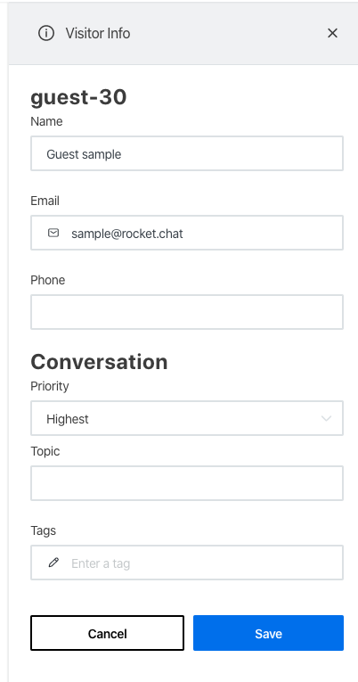

# Priorities

To access **Priorities** settings:

Go to **Priorities** in the omnichannel panel settings, as shown below:

1. Click **Add** button.

2. Name your Priority.

3. Give a description.  

4. Set Due Time.

5. Click **Save**.

Your new priority is saved, as shown below:

Each priority has its own\(unique\) `Estimated due time` field\(time in minutes\), so once a priority is associated with an `Inquiry/room`, this field will be used to set the queue inquiry order. As the priority is not mandatory, the Omnichannel queues will have inquiries with and without priorities. To support both possibilities, I refactored the structure of the fields that are used to sort the queues as displayed below

**queueOrder:**  
1 - default, is set when there is no priority associated with the room;  
0 - Is set when a priority is associated with a room, so inquiries with the `queueOrder = 0` will be attended before inquiries without associated priority.

**estimatedWaitingTimeQueue:**  
This value is updated when a priority is defined in a room. This value comes from the 'Estimated due time' field of the priority defined in the room.

**estimatedServiceTimeAt:**  
This value represents the estimated time that the inquiry should be attended by an agent.  When a priority is associated with an inquiry, this field will be updated and the new value will be the date/time\(ts field\) of the inquiry creation plus the estimated due time defined in the priority \(Time in Minutes\). So, let say the inquiry was created at `2020-04-16 20:12:23` and the estimated due time of the priority is `15 minutes`, the `estimatedServiceTimeAt` value will set to `2020-04-16 20:27:23`.

Also, the agents and managers can change the inquiry priority through the `room info panel`:

When room priority is changed, the fields described above are updated. The same happens when `estimated due time field` is updated. Then, all inquiries associated with the priority will also be updated and this change will reflect in the queue.

It's also possible to change room priority through the REST API. A new endpoint is available, as well as the endpoint that creates omnichannel rooms will support the `priority` when running the `enterprise` version, so it's possible to create a new omnichannel conversation with a priority associated.

