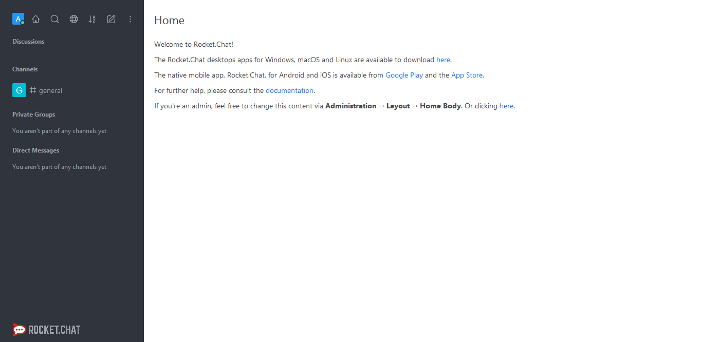
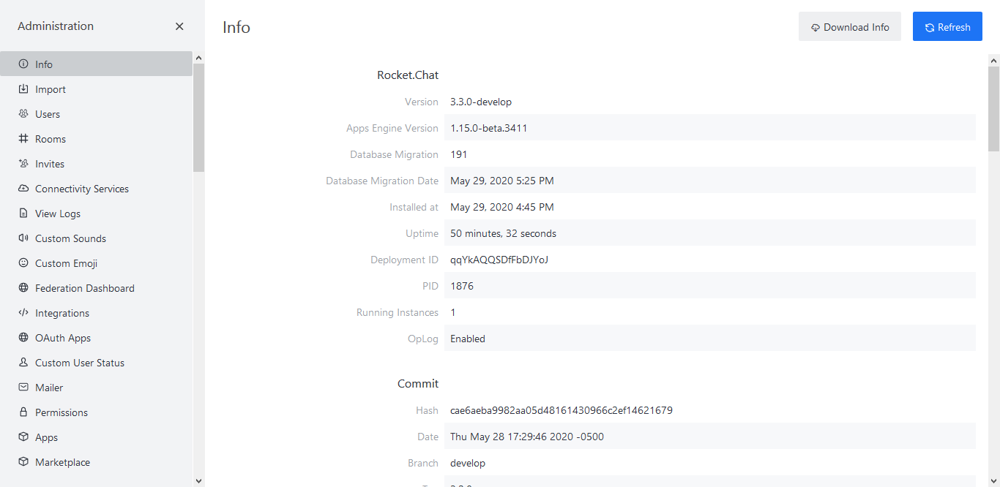
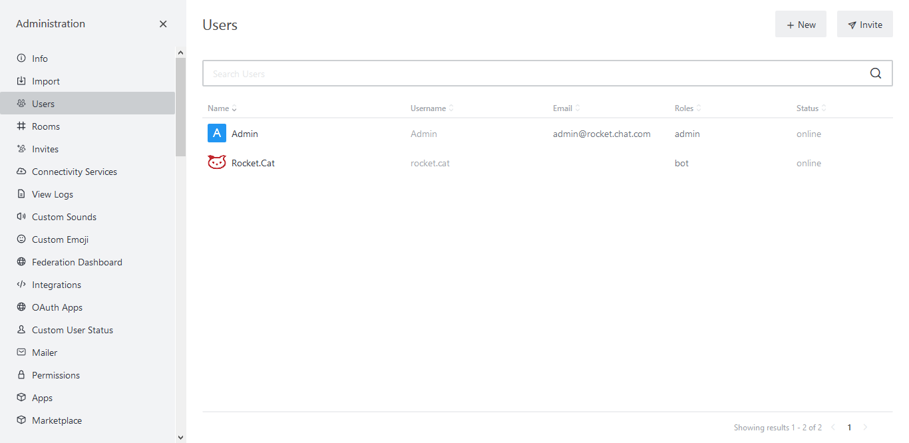
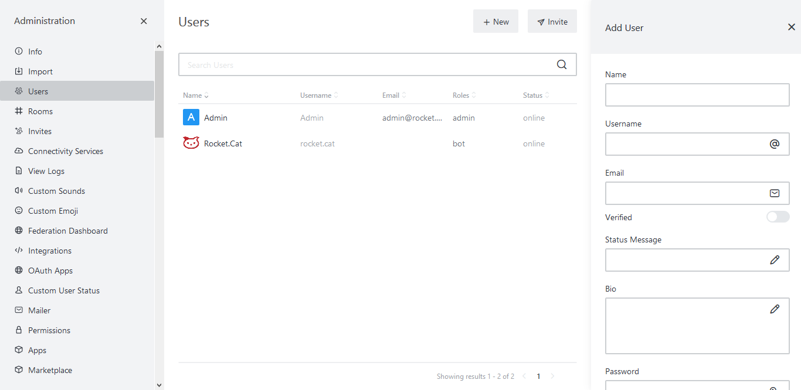
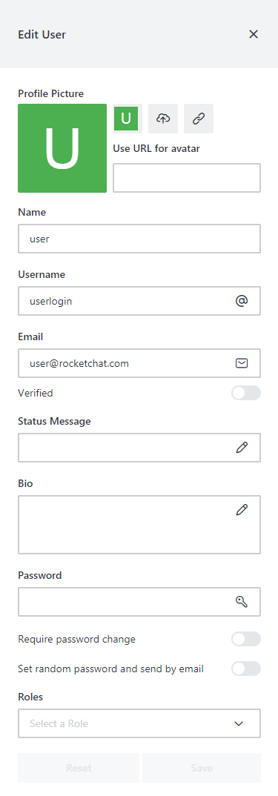
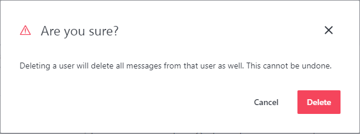

# User Management

The purpose of this document is to demonstrate how to perform some management actions on Rocket.Chat users. 
This guide assumes that the administrator has already completed the installation and basic configuration of your Rocket.Chat server.
After starting your Rocket.Chat instance and logging in, you will see the system home screen.

  

To access the administrative area, click on the **options []** button and select the “Administration” option.

 

The home page of the administrative area will be displayed, as shown in the screenshot below:

 

To access the users panel, in the menu on the left, click the **Users []** button, the following screen will be displayed:

  

In this guide, we will check:

- How to create a new user;
- How to reset a user password;
- How to disable users;
- How to enable users;
- How to remove users;
- How to change a user roles.

Next we will analyze how to carry out the mentioned procedures.

## Creating a new user

In Rocket.Chat it is possible to add users directly through the users administration panel or by inviting them. In this guide we will exemplify how to perform this first operation, click on the **[]** button, the menu for adding users will be displayed on the right.

  

Complete the form as exemplified:

- **Name:** Enter the user name. Ex.: user; 
- **Username:** Enter the user login credentials. Ex.: userlogin;
- **Email:** Inform the user email address. Ex.: user@rocketchat.com;
- **Verified []:**  If this option is active, this user will already be verified without needing to confirm via a verification email;
- **Status message:** Defines a personalized message that appears in the status field in the user profile;
- **Bio:** In this field it is possible to write a short biography about the user that will appear in the status field in the user profile;
- **Password:** Enter the password that the user should use to log in;
- **Require password change []:** If active, this option will determine that the user will be required to change his password at the next login;
- **Set random password and send by email []:** If active, this option will determine that the user will receive a randomly generated password in the registered email;
- **Roles:** Defines the role of the user, roles are used to define the level of access in the system;
- **Join default channels []:** Determines whether this user will automatically be inserted into standard channels;
- **Send welcome email []:** If active, this option will send a welcome message to the registered email.

If you want to close this window click on the **[]** button, but if you prefer to save this information and create the user click on the **[]** button.

  
 
The created user will be displayed on the panel, as shown below:

  
 
Next, we will look at how to reset a user password.

## Reseting passwords

To reset a user password, select it, more information about it will be displayed in a menu on the right side of the screen.

 

Click the **[]** button, the menu with the information that has been added to the user profile will be displayed.

 

To reset the password, simply activate the option **Require password change []** so that the user is required to change their own password at the next login.
Finally, click the **[]** button to make changes.

Next, we will look at how to disable a user.

## Disabling users

To disable a particular user, select it, more information about it will be displayed in a menu on the right side of the screen.

  

Click on the **[]** button, a menu with some options will be displayed, to disable a user click on the **[]** option, as shown below:

  

Next, we will look at how to enable a user.

## Enabling users

To enable a particular user, select them, more information about it will be displayed in a menu on the right side of the screen.

 

Click on the **[]** button, a menu with some options will be displayed, to enable a user click on the **[]** option, as shown below:

  

Next, we will look at how to remove a user.

**Removing users**

To remove a particular user, select them, more information about it will be displayed in a menu on the right side of the screen.

 

Click on the **[]** button, a menu with some options will be displayed, to remove a user click on the **[]** option, as shown below:

  

An alert message will be displayed to confirm the user deletion. Note that after performing this action, the user will be permanently deleted.

  

If you want to close this window and do not remove the user, click the **[]** button. However, if you are sure that you want to remove the user click on the **[]** button, the user will be deleted and the notification below will be displayed.

  

To close this window, just click the **[ ]** or **[ ]** button.

Next, we will look at how to change a user role.

## Changing users roles

The function of user roles is to define which system resources it will have access, to change these roles, follow the steps described bellow.
Select the desired user, more information about that particular user will be displayed in a menu on the right side of the screen.

 

Click the **[ ]** button, the menu with the information that has been added to the user's profile will be displayed.

 

To change the roles linked to a user, access the Roles combobox and select the desired option. In this example we will give the user administrative powers, for that we will select **"Admin"**.

 

Finally, click the **[ ]** button to make changes.

After saving, the role will be displayed in the user profile, as shown in the screenshot below the **"Role"** field.

 

